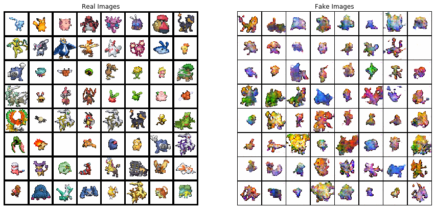
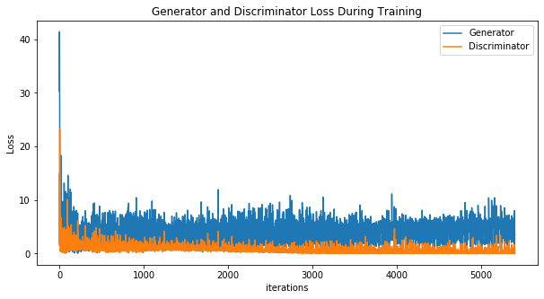

# PokéGan
---
PokéGAN is an exploratory project into Generative Adversarial Networks (GANs). GANs have been used to generate everything from [human faces](https://thispersondoesnotexist.com/) to [anime characters](https://make.girls.moe/) to [pose estimation](https://arxiv.org/pdf/1705.09368.pdf) and [transforming zebras to horses.](https://github.com/junyanz/CycleGAN) For an understanding of what GANs are, check out [this article.](https://skymind.ai/wiki/generative-adversarial-network-gan) (Or one of the other million ones out there.)

## My Inspiration:

Well, the GAN part was just mostly curiosity. The Pokémon part is more of me being a very big Pokénerd. Years and years ago, there was a fairly large community of Pokémon fans who used to "sprite" on forums. [This](https://www.dragonflycave.com/spriting-guide) is an excellent guide to spriting. But essentially, I wanted to make new Pokemon sprites. ~~Mostly because I was terrible at everything apart from recolors.~~

## The Data:

Remember, we're talking sprites. [Example of a sprite.](https://pokemondb.net/sprites/mewtwo). I decided to take all the sprites from the games released for the Nintendo DS. 
This is for a couple of reasons. The later 3DS games utilize this 3D art style that I don't think will work well with GANs, especially considering the relatively lower count for sprites there. I'm also not using sprites from games that appeared for older consoles since they're quite dated. Additionally, most of the DS games had very similar styles. So that leaves:
* Diamond, Pearl & Platinum
* HeartGold & SoulSilver
* Black & White
* Black 2 & White 2

### Getting our Data:
The nice thing about Pokémon is that data is easy to come by. I was able to procure the sprites from [Veekun.](https://veekun.com/dex/downloads) Sadly, the site contains only sprites until Black and White. While I'm sure that it exists somewhere on the internet, I wasn't able to find it in a good enough format on an initial search. So I guess my earlier statement wasn't entirely true. Regardless, I went ahead with the rest of the games mentioned above.

### The Data Itself:
While there's some 800-odd Pokémon as of 2019, these games were released a while ago. So we actually have a lower number of Pokémon to work with. However, we aren't restricted to just a single sprite of each Pokémon. A lot of Pokémon have a slight variation in their appearance between male and female versions. These may or may not be significant variance. Hippopotas has a noticeable difference in color while Raticate looks pretty much the same to me. (Not really, they are slightly different, but you get the point.) Additionally, some of the games have a 2nd frame for most Pokémon. This is usually for the animation when the Pokémon is sent out and stuff. And finally, there are shiny versions of almost every Pokémon. Shinies are just rarer versions of Pokémon which have a different color scheme. 

|Image Type|Diamond, Pearl & Platinum|Heart Gold & Soul Silver|Black & White|
|---|---|---|---|
|Normal|567|571|750|
|Female|90|90|93|
|Frame 2|567|539*|-|
|Female Frame 2|90|90|-|
|Shiny|567|569**|750|
|Shiny Female|90|90|93|
|Shiny Frame 2|567|539|-|
|Shiny Female Frame 2|90|90|-|
|Total|2628|2578|1686|

\* - Unown doesn't seem to have a frame 2. Hence the lower count.
\** - Two special sprites (172-beta_hgss, 421-beta_hgss) don't have shiny forms.

So we have a total of **6892** images. 

## The Model:
I'm using a pretty standard DCGAN model.

Generator:

|Layer|Input Shape|Output Shape|Activation Function|
|---|---|---|---|
|ConvTranspose2D-1|(100, 1, 1)|(512, 4, 4)|ReLU|
|ConvTranspose2D-2|(512, 4, 4)|(256, 8, 8)|ReLU|
|ConvTranspose2D-3|(256, 8, 8)|(128, 16, 16)|ReLU|
|ConvTranspose2D-4|(128, 16, 16)|(64, 32, 32)|ReLU|
|ConvTranspose2D-5|(64, 32, 32)|(3, 64, 64)|Tanh|

Discriminator:

|Layer|Input Shape|Output Shape|Activation Function|
|---|---|---|---|
|Conv2D-1|(3, 64, 64)|(64, 32, 32)|Leaky ReLU|
|Conv2D-2|(64, 32, 32)|(128, 16, 16)|Leaky ReLU|
|Conv2D-3|(128, 16, 16)|(256, 8, 8)|Leaky ReLU|
|Conv2D-4|(256, 8, 8)|(512, 4, 4)|Leaky ReLU|
|Conv2D-5|(512, 4, 4)|(1, 1, 1)|Sigmoid|

## The Results:

Now, quite obviously, these look nothing like actual Pokémon. I sort of expected this for two reasons:
1. ~7000 images is actually ridiculously low for training a GAN. Most GANs need far more data for good results.
2. Pokémon. Each individual Pokémon is pretty different. There's not too many similarities between say, Pikachu and Giratina. Some Pokémon are literally just rocks or magnets or ice cream cones. Some have no visible eyes, some have one or two while others have a lot of them. There are arms, fins, wings and tails. Some fly, some have legs, some are just floating blobs. So to try and make something that *feels* like a Pokémon is hard. But I'm still moderately satisfied with the results.
 

(Iterations here indicates batches, not epochs.)
Looking at the loss seems to confirm my suspicions as well. The losses could be a little better, but for the most part the model seems to be trying its hardest. 

### Future Improvements:
So I've only used a standard DCGAN here. The obvious changes to make would be to use of of the many, many, many more GANs that released later. I would really like to try out a Progressively Growing GAN in the future. Additionally, maybe using more images or even using the original, larger, and more detailed artwork by Ken Sugimori.